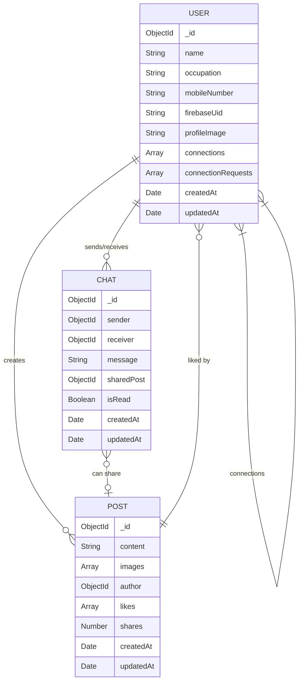

# DocConnect Healthcare Application

DocConnect is a modern healthcare social platform connecting healthcare professionals. It allows users to create profiles, share posts with images, like and share content, and communicate via direct messages.

## 🏗️ Project Structure

The project is structured as a monorepo containing both the React Native (Expo) frontend and Node.js/Express backend.

### Frontend (Client)
- **Framework:** React Native with Expo & Expo Router
- **Styling:** Tailwind CSS (NativeWind) / Custom CSS
- **State Management:** Context API
- **Forms:** React Hook Form & Zod
- **API Client:** Axios

```text
client/
├── assets/            # Static assets (images, fonts)
├── src/
│   ├── app/           # Expo Router file-based routing
│   │   ├── (auth)/    # Authentication flows (login, onboarding)
│   │   ├── (tabs)/    # Main tab navigation (home, discover, messages)
│   │   ├── (admin)/   # Admin/Profile routes
│   │   └── _layout.tsx# Root layout
│   ├── components/    # Reusable UI components (PostCard, DiscoverCard, etc.)
│   ├── context/       # React Context (AuthContext)
│   └── services/      # API configurations (axios)
└── global.css         # Global styles
```

### Backend (Server)
- **Framework:** Node.js with Express
- **Database:** MongoDB (Mongoose)
- **Authentication:** Firebase Auth
- **Storage:** Cloudinary (for images)

```text
server/
├── seeds/             # Database seeding scripts (seed.js)
├── src/
│   ├── controller/    # Request handlers (auth, post, chat logic)
│   ├── middleware/    # Custom middlewares (auth validation)
│   ├── model/         # Mongoose schemas (User, Post, Chat)
│   └── routes/        # Express routers (v1 API routes)
├── index.js           # Entry point and server configuration
└── .env               # Environment variables
```

## 🔄 User Flows

1. **Authentication & Onboarding Flow:**
   - User enters mobile number.
   - OTP is sent via Firebase Auth.
   - User verifies OTP.
   - If new user -> Redirects to Onboarding (Name, Occupation, Profile Picture).
   - If existing user -> Redirects to Home Feed.

2. **Main Feed & Post Flow:**
   - User views the Home feed containing posts from all users.
   - User can create a new post with text and upload multiple images (via Cloudinary).
   - User can like and share posts.

3. **Discovery & Connection Flow:**
   - User navigates to Discover tab.
   - User can view other healthcare professionals.
   - User can manage connections.

4. **Messaging Flow:**
   - User navigates to Messages tab.
   - User can select a connection and initiate a real-time/direct chat.
   - Users can share posts within the chat.

## 📊 Entity Relationship Diagram (ERD)



## ⚙️ Core Processes & Business Logic

1. **User Authentication (Firebase + MongoDB):**
   - Firebase handles the OTP and returns a unique `firebaseUid`.
   - The backend validates the Firebase token and checks if the `firebaseUid` exists in MongoDB.
   - A custom JWT or the Firebase token is used for subsequent requests via the `Authorization` header.

2. **Post Creation & Image Uploads:**
   - Client selects images using `expo-image-picker` and converts them to base64.
   - Backend receives the base64 strings and uploads them to **Cloudinary**.
   - Cloudinary returns secure URLs which are saved in the `Post` document.

3. **Database Seeding:**
   - A `seed.js` script automatically drops the database and populates it with dummy users (Doctors, Nurses, Students) and pre-configured posts with images. It also automatically connects all seeded users together.
